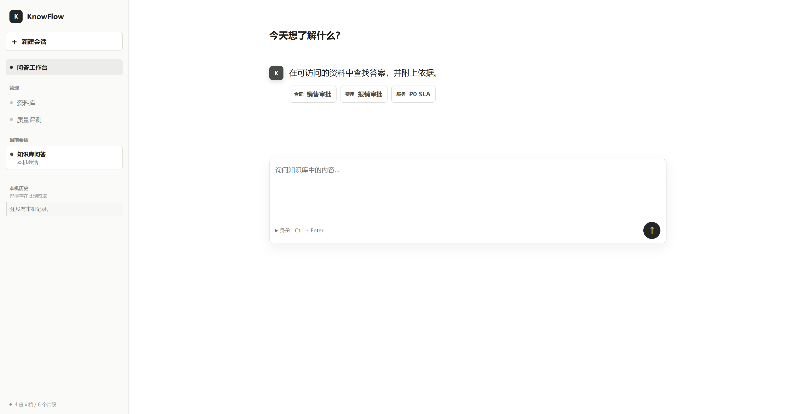
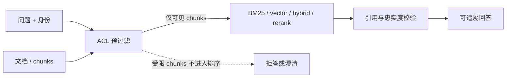

# KnowFlow RAG Agent

[](https://github.com/dafu110/knowflow-rag-agent/actions/workflows/ci.yml)
[](LICENSE)

企业知识库 RAG Agent，支持文档上传、结构化切分、BM25/TF-IDF/外部 embedding 混合检索、外部 reranker、可选 LLM 证据合成、来源引用、答案评估、多轮追问、权限过滤、幻觉检测、SQLite/JSONL 存储和离线评测集。

## 界面预览




## 快速开始

```powershell
python -m pip install -e ".[dev]"
```

```powershell
python -m knowflow.cli ingest sample_docs --reset
python -m knowflow.cli ask "销售合同审批需要哪些材料？" --user alice --roles sales
python -m knowflow.cli eval evals/rag_eval_set.jsonl
python -m knowflow.cli serve --port 8765
```

打开 `http://127.0.0.1:8765` 可使用上传和问答界面。

## Docker 运行

仓库包含 `.env.example`、`Dockerfile` 和 `docker-compose.yml`，可直接启动 SQLite 持久化的 Web 服务：

```powershell
docker compose up --build
```

启动后访问 `http://127.0.0.1:8765`。正式部署前建议复制 `.env.example` 为 `.env` 并替换真实 token、模型密钥和网关地址；`.env` 已被忽略，不会进入 Git。

## 架构与评测

- 架构说明：[docs/architecture.md](docs/architecture.md)
- RAG 设计与实验方法：[docs/rag-design.md](docs/rag-design.md)
- 四策略实验结果与解释：[docs/retrieval-experiment.md](docs/retrieval-experiment.md)
- 离线评测集：`evals/rag_eval_set.jsonl`，覆盖检索召回、引用准确率、忠实度、权限泄漏和拒答场景。
- CI 质量门禁：`scripts/check_eval.py` 会在临时知识库中导入 `sample_docs/`，分别运行主评测集和独立 holdout 集，并要求 recall@k >= 0.95、MRR >= 0.90、引用准确率 >= 0.95、忠实度 >= 0.95、权限泄漏为 0。holdout 覆盖同义改写、错别字、中英混输、无答案、跨文档和越权提示注入。

### 权限先于排序



权限过滤在排名前执行，因此受限内容不会出现在分数、调试轨迹、引用或最终上下文中。

## 能力清单

- 文档上传：Web 表单和 CLI 目录导入，支持 UTF-8 `.txt`、`.md`、`.csv`、`.json`；`.pdf`、`.docx` 在零依赖版本会明确拒绝，并提示转换为受支持格式。
- 文档切分：按标题、段落和长度切分，并保留父级标题、来源、权限、业务标签等元数据。
- 向量检索：内置 TF-IDF 余弦检索，零依赖可离线运行；生产模式可接 OpenAI-compatible embedding，并在进程内缓存 chunk 向量，避免每次提问重复嵌入全库。
- 混合检索：BM25 + TF-IDF/embedding 归一化融合，先做权限过滤，再做相关性召回。
- 重排：结合关键词覆盖、短语命中、标题匹配、近邻密度和新鲜度进行二次排序；也可接外部 rerank 服务。
- 引用来源：回答按证据块生成，并返回 `source#chunk_id` 引用。
- LLM 合成：默认使用证据抽取式回答；配置后可调用 OpenAI-compatible chat model，并保留引用和忠实度检查。
- 答案评估：离线评测集支持 recall@k、MRR、引用正确率、权限泄漏检查、忠实度评分和平均时延；`python scripts\retrieval_experiment.py` 可对比 BM25、vector、hybrid、rerank 四种策略。
- 多轮追问：会话会保留最近问答和已引用证据，用于补全省略问题。
- 权限过滤：文档可声明 `allowed_roles` 和 `allowed_users`，未授权内容不会进入检索和回答。
- API 认证：支持 `KNOWFLOW_AUTH_TOKENS=token:user:role1,role2`，服务端从 token 推导身份，避免信任前端伪造角色。
- 幻觉检测：答案句子必须被检索证据覆盖；无法支撑或当前身份无权访问时返回拒答，并明确呈现权限/证据边界。
- 意图守门：敏感数据、临时授权、密钥等问题必须命中安全/权限语境证据，否则拒答。
- 检索可解释：每条召回结果输出 BM25、vector、rerank、strong/weak evidence 和命中原因。

## 文档权限格式

文档顶部可选 YAML-like 元数据块：

```text
---
title: 销售合同审批指南
allowed_roles: sales, legal
allowed_users: alice
tags: sales, contract
---
正文内容...
```

没有声明权限的文档默认对所有用户可见。

## 检索实验

```powershell
python scripts\retrieval_experiment.py
```

同一语料和评测集会输出四种策略的 Recall@K、MRR、引用准确率、忠实度、权限泄漏和平均时延。请以业务语料上的 held-out 结果选择生产策略；内置样本文档规模较小，不应单凭它宣称某个策略普遍更优。

## Web API

- `POST /upload`：multipart 上传文档。
- `POST /ask`：JSON 问答。
- `POST /eval`：运行默认评测集。
- `GET /health`：健康检查和索引统计。
- `GET /identity`：returns the authenticated user and roles when `KNOWFLOW_AUTH_TOKENS` is configured.
- `GET/POST/DELETE /sessions`：authenticated, persistent conversation history; shared sessions are read-only and fork automatically when a collaborator continues asking.

`/ask` 请求示例：

```json
{
  "question": "销售合同审批需要哪些材料？",
  "user": "alice",
  "roles": ["sales"],
  "session_id": "demo"
}
```

如果配置了 `KNOWFLOW_AUTH_TOKENS`，请求需要携带 `x-knowflow-token`，且服务端会忽略请求体里的 `user` 和 `roles`：

```powershell
$env:KNOWFLOW_AUTH_TOKENS="sales-token:alice:sales;security-token:ciso:security"
python -m knowflow.cli serve --port 8765
```

## 生产模式

### SQLite 存储

JSONL 适合本地演示；生产或长期运行建议使用 SQLite：

```powershell
python -m knowflow.cli --store-backend sqlite --store data/knowflow.db ingest sample_docs --reset
python -m knowflow.cli --store-backend sqlite --store data/knowflow.db ask "P0 故障的恢复目标是什么？" --user chen --roles support
```

### 外部 embedding / LLM / reranker

KnowFlow 默认零依赖离线运行；配置环境变量后会启用生产模型后端，失败时自动回退到本地策略。

```powershell
$env:OPENAI_API_KEY="..."
$env:KNOWFLOW_EMBEDDING_PROVIDER="openai"
$env:KNOWFLOW_EMBEDDING_MODEL="text-embedding-3-small"
$env:KNOWFLOW_LLM_PROVIDER="openai"
$env:KNOWFLOW_LLM_MODEL="gpt-4.1-mini"
```

OpenAI-compatible 网关可覆盖 base URL：

```powershell
$env:KNOWFLOW_EMBEDDING_BASE_URL="https://your-gateway.example.com/v1"
$env:KNOWFLOW_LLM_BASE_URL="https://your-gateway.example.com/v1"
```

外部 reranker 使用通用 JSON HTTP 接口：

```powershell
$env:KNOWFLOW_RERANK_URL="https://rerank.example.com/rerank"
$env:KNOWFLOW_RERANK_API_KEY="..."
```

请求格式为 `{ "query": "...", "documents": [...] }`，响应支持 `{ "scores": [0.9, 0.2] }` 或 `{ "results": [{"index": 0, "score": 0.9}] }`。

### WSGI 部署

本地 `serve` 命令用于开发和演示。生产部署建议使用 WSGI 服务器托管 API：

```bash
KNOWFLOW_STORE_BACKEND=sqlite \
KNOWFLOW_STORE=data/knowflow.db \
KNOWFLOW_AUTH_TOKENS="<sales-token>:alice:sales;<admin-token>:admin:admin" \
KNOWFLOW_SESSION_STORE=data/knowflow_sessions.db \
gunicorn knowflow.wsgi:application --bind 0.0.0.0:8765 --workers 2
```

## 目录结构

```text
knowflow/
  agent.py        # 多轮 RAG Agent、答案生成、幻觉检测
  chunking.py     # 文档解析和结构化切分
  cli.py          # CLI 入口
  evaluation.py   # 离线评测
  models.py       # 数据模型
  retrieval.py    # BM25、TF-IDF、混合检索、重排
  server.py       # 本地 Web 服务、安全边界和静态资源路由
  sqlite_store.py # SQLite 持久化知识库
  store.py        # JSONL 持久化知识库
  wsgi.py         # 生产 WSGI 入口
  web/            # HTML/CSS/JS 静态资源
```

## 设计边界

当前版本默认专注展示可离线运行的 RAG 工程能力，生成答案采用“证据抽取 + 合成”的可解释策略。生产模式已支持外部 embedding、LLM、reranker、SQLite、token 身份映射和 WSGI 部署；上线时仍建议接入企业级密钥管理、审计日志、监控告警和反向代理 TLS。

## Launch Readiness

- [Launch hardening checklist](docs/launch-hardening.md)
- [ADR: Pre-ranking permission filtering](docs/adr/0001-pre-ranking-permission-filtering.md)
- [RAG design and retrieval experiments](docs/rag-design.md)
- [Retrieval experiment report](docs/retrieval-experiment.md)
- [API reference](docs/api.md)
- [Deployment and operations](docs/deployment.md)
- Demo smoke flow: `python scripts\demo_flow.py`
