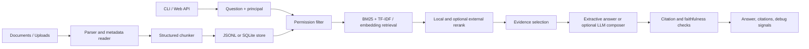

# KnowFlow Architecture

KnowFlow is a local-first enterprise RAG agent. The default path runs without external model services, while production settings can enable OpenAI-compatible embeddings, chat completion, external reranking, SQLite persistence, and WSGI deployment.

## System Flow

## Main Modules

- `knowflow/chunking.py`: reads `.txt`, `.md`, `.csv`, and `.json` files, extracts YAML-like metadata, and creates section-aware chunks.
- `knowflow/store.py` and `knowflow/sqlite_store.py`: provide JSONL and SQLite persistence with document/chunk lifecycle operations.
- `knowflow/retrieval.py`: applies role/user visibility filtering, BM25 scoring, TF-IDF cosine scoring, optional embedding scores, and rerank features.
- `knowflow/agent.py`: manages conversation context, evidence selection, answer composition, citation generation, refusal behavior, and hallucination risk.
- `knowflow/providers.py`: contains OpenAI-compatible embedding/chat adapters and a generic HTTP reranker adapter.
- `knowflow/server.py`: exposes upload, ask, eval, health, and document APIs with token auth, size limits, path restrictions, rate limiting, and security headers.
- `knowflow/audit.py`: writes optional JSONL audit events for ask/upload/eval/delete/error flows when `KNOWFLOW_AUDIT_LOG` is configured.
- `knowflow/evaluation.py`: runs offline evals, reports recall@k, MRR, citation accuracy, faithfulness, permission leaks, average latency, and compares the four retrieval strategies.

## Retrieval And Grounding

1. The user identity is converted into a `Principal` with `user` and `roles`.
2. Chunks not visible to that principal are removed before ranking.
3. Queries are tokenized with Chinese character n-grams and expanded with domain synonyms.
4. BM25 and TF-IDF/embedding scores are normalized; the experiment runner can compare BM25, vector, hybrid, and rerank strategies.
5. Optional embedding scores replace the local TF-IDF vector score when configured and available.
6. Rerank signals reward term coverage, exact phrase matches, title matches, nearby terms, freshness, and optional external reranker scores.
7. The agent only answers from strong evidence. Unsupported or sensitive questions fall back to refusal or clarification.

## Security Boundaries

- Uploads are limited by extension, filename normalization, and maximum body size.
- API calls can use `KNOWFLOW_AUTH_TOKENS=token:user:role1,role2`; when enabled, request body roles are ignored.
- Eval file paths are restricted to the `evals/` directory.
- Static file serving is locked to known CSS/JS assets.
- Responses include CSP, `X-Frame-Options`, `X-Content-Type-Options`, and referrer policy headers.
- Sensitive intents such as customer data, temporary authorization, keys, passwords, and backups must retrieve matching security evidence before the agent answers.
- Audit logging records request/action summaries and request IDs without storing tokens, full answers, or uploaded document content.
- Conversation memory keys include the principal and role set, so shared client session IDs cannot cross identity boundaries.
- The index version includes chunk ACL metadata; permission updates and document deletion force a retriever rebuild.

## Evaluation Gate

CI runs `scripts/check_eval.py` against `evals/rag_eval_set.jsonl` after ingesting `sample_docs/`. The current quality gate expects:

| Metric | Threshold |
|---|---:|
| recall@k | >= 0.95 |
| MRR | >= 0.90 |
| citation accuracy | >= 0.95 |
| faithfulness | >= 0.95 |
| permission leaks | 0 |

Current local result: 32 cases, recall@k 1.0, MRR 0.981, citation accuracy 1.0, faithfulness 1.0, permission leaks 0.

## Deployment Notes

- Local demos can use the default JSONL store at `data/knowledge_store`.
- Long-running deployments should use `KNOWFLOW_STORE_BACKEND=sqlite` and `KNOWFLOW_STORE=data/knowflow.db`.
- `Dockerfile` runs the WSGI app with Gunicorn on port `8765`.
- `docker-compose.yml` mounts a named volume for `/app/data`.
- Production environments should inject real secrets through environment variables or a secret manager, not through committed files.
